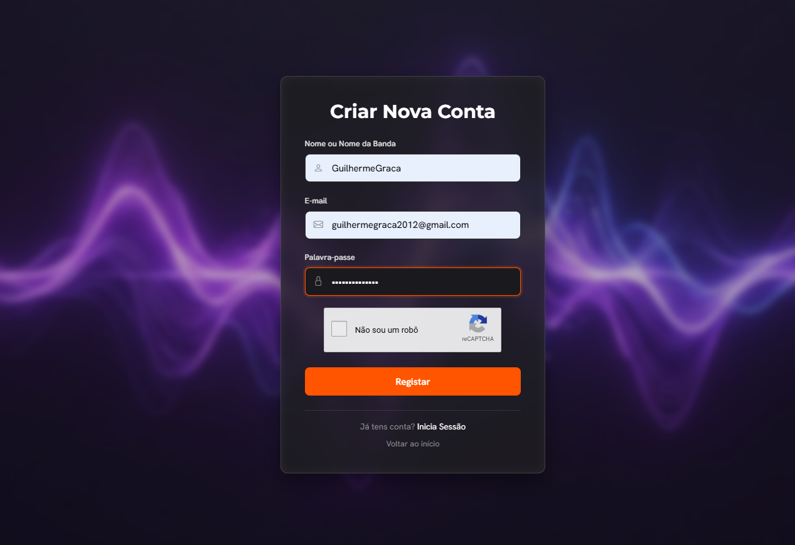
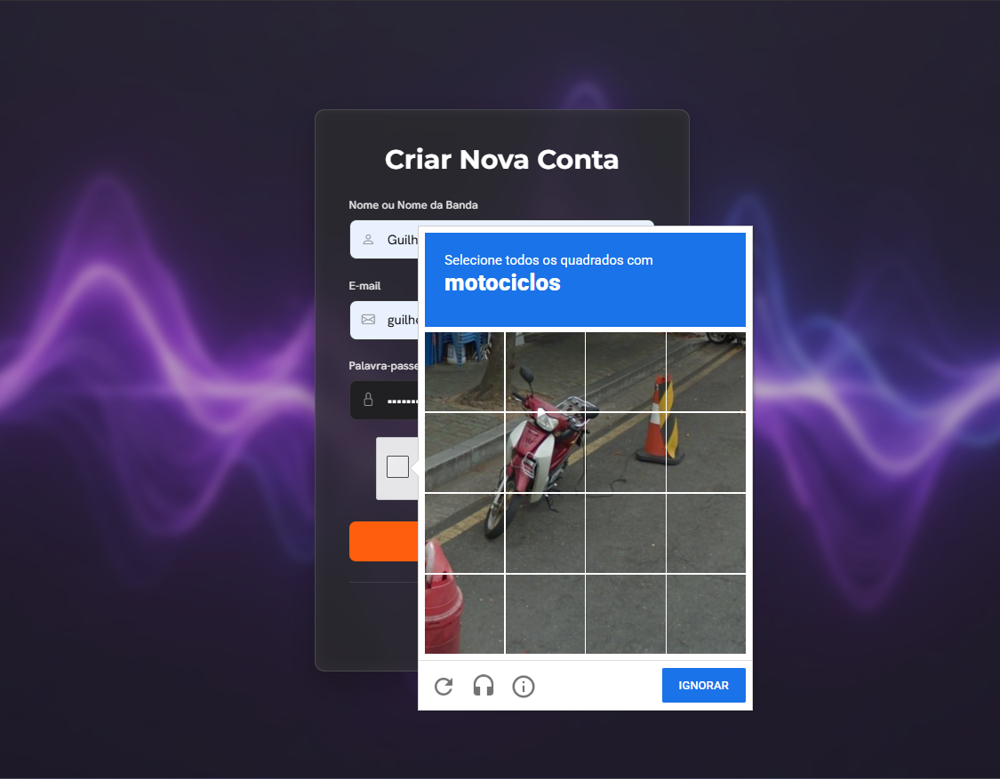
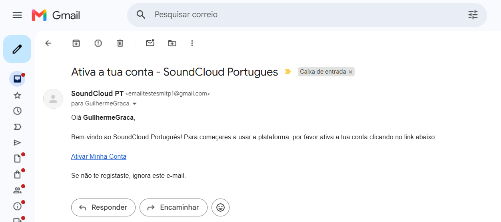

<a id="readme-top"></a>
<!-- PROJECT LOGO & HEADER -->
<br />
<div align="center">
  <a href="https://github.com/GuilhermeGraca/php-content-management-system">
    
  </a>

  <h3 align="center">SoundCloud Clone CMS</h3>

  <p align="center">
    An audio content management system that allows users to upload, manage, and stream music tracks.
    <br />
    <br />
    <a href="#about-the-project"><strong>Explore the Documentation »</strong></a>
    <br />
    <br />
    <a href="https://github.com/GuilhermeGraca/php-content-management-system/issues">Report Bug</a>
    &middot;
    <a href="https://github.com/GuilhermeGraca/php-content-management-system/issues">Request Feature</a>
  </p>
</div>

<!-- TABLE OF CONTENTS -->
<details>
  <summary>Table of Contents</summary>
  <ol>
    <li>
      <a href="#about-the-project">About The Project</a>
      <ul>
        <li><a href="#built-with">Built With</a></li>
        <li><a href="#features--key-highlights">Features & Key Highlights</a></li>
      </ul>
    </li>
    <li><a href="#lessons-learned">Lessons Learned</a></li>
    <li>
      <a href="#getting-started">Getting Started</a>
      <ul>
        <li><a href="#prerequisites">Prerequisites</a></li>
        <li><a href="#installation--running-locally">Installation & Running Locally</a></li>
      </ul>
    </li>
    <li><a href="#usage">Usage</a></li>
    <li><a href="#contact">Contact</a></li>
    <li><a href="#acknowledgments">Acknowledgments</a></li>
  </ol>
</details>

---

<!-- ABOUT THE PROJECT -->
## About The Project

<div align="center">


https://github.com/user-attachments/assets/87f99139-00bb-45c6-8f0c-79319b2c6462


  <br />
  <p align="center">
    <em>If the embedded video above is not displaying correctly, <a href="preview/previewSGCsystem.mp4"><strong>click here to watch/download the video demo »</strong></a></em>
  </p>
</div>
<br />

### Application Screenshots

<div align="center">
  
  <p><em>Step 1: Registration Form</em></p>
  <br/>
  
  
  <p><em>Step 2: Google reCAPTCHA v2 Verification</em></p>
  <br/>
  
  
  <p><em>Step 3: Account Activation via E-mail</em></p>
</div>
<br />

This repository contains **SoundCloud Clone CMS**, an academic project developed from scratch for the *Sistemas Multimédia para a Internet (SMI)* course at **ISEL (Instituto Superior de Engenharia de Lisboa)**. Developed in 2026, this project also marks my first hands-on experience building a backend system with PHP. The primary goal of this project is to build a web platform exclusively for independent Portuguese artists. It organizes music regionally by district and allows musicians to share their audio tracks directly with their local audience.

*Note: You can find a detailed technical report written in Portuguese inside the `academic-documentation/` folder.*

<p align="right">(<a href="#readme-top">back to top</a>)</p>

---

### Built With

* [](https://php.net/)
* [](https://www.mysql.com/)
* [](https://www.docker.com/)
* [](https://getbootstrap.com)
* [](https://leafletjs.com/)
* [](https://developers.google.com/recaptcha)
* [](https://www.openstreetmap.org/)
* [](https://nominatim.org/)
* [](https://github.com/PHPMailer/PHPMailer)

<p align="right">(<a href="#readme-top">back to top</a>)</p>

---

### Features & Key Highlights

* **User Roles & Access Control**: Distinct profiles from casual guests and fans to content-creating artists and platform administrators.
* **Batch Audio Uploads**: Artists can upload entire albums at once using a single ZIP file containing MP3/WAV files, cover images, and an XML metadata file.
* **Interactive Concert Map**: Artists can announce live events, and the system automatically geocodes the location using the Nominatim API to display it on a Leaflet.js interactive map.
* **Subscriptions & In-App Notifications**: Fans can subscribe to specific districts or music genres and receive automatic notifications when new tracks are published.
* **Secure Authentication**: Includes password hashing, two-factor authentication via email using PHPMailer, and Google reCAPTCHA v2 to prevent automated bots.

<p align="right">(<a href="#readme-top">back to top</a>)</p>

---

<!-- LESSONS LEARNED -->
## Lessons Learned

* **Server-Side Architecture**: Understanding the client-server model, where PHP executes logic and interacts with the database exclusively on the server before generating and returning the final HTML to the user's browser.
* **Server-Side File Processing**: Handling binary file uploads, extracting ZIP archives, and safely parsing XML metadata with PHP SimpleXML.
* **Relational Database Integrity**: Designing MySQL schemas with cascading foreign keys to securely link users, audio content, genres, and geographic regions.
* **Web Security Principles**: Applying the principle of least privilege, preventing SQL Injection with prepared statements, and securely validating user sessions.
* **Third-Party Integrations**: Interacting with external services like the OpenStreetMap Nominatim API for geocoding and Google APIs for spam protection.

<p align="right">(<a href="#readme-top">back to top</a>)</p>

---

<!-- GETTING STARTED -->
## Getting Started

Follow these instructions to set up a local copy of the project on your machine.

### Prerequisites

* [Docker Desktop](https://www.docker.com/products/docker-desktop/) (Recommended)
* Alternatively, XAMPP or any local web server stack.

### Installation & Running Locally

1. **Clone the repository**:
   ```sh
   git clone https://github.com/GuilhermeGraca/php-content-management-system.git
   ```
2. **Navigate to the directory**:
   ```sh
   cd php-content-management-system
   ```
3. **Configure the credentials**:
   Inside the `src/` folder, rename the `credenciais.exemplo.php` file to `credenciais.php`. Fill in your SMTP details and Google reCAPTCHA keys if you want to test email and registration features.

4. **Start the environment**:

   **Using Docker (Recommended)**:
   ```sh
   docker-compose up -d
   ```
   Access the application at `http://localhost:8080`.

   **Using XAMPP**:
   - Copy the contents of the `src/` folder into your XAMPP `htdocs` directory.
   - Create a database named `bd_soundcloud_pt` and import `database/base_dados.sql`.
   - Access the application at `http://localhost/your-folder-name`.

<p align="right">(<a href="#readme-top">back to top</a>)</p>

---

<!-- USAGE -->
## Usage

After starting the application, you can register a new account. Since email activation is required, ensure your `credenciais.php` has valid SMTP details, or manually set your account as active directly in the `utilizadores` table via PHPMyAdmin (`http://localhost:8081`). Once logged in as an artist, you can access the dashboard to upload music tracks using the provided XML/ZIP structure.

<p align="right">(<a href="#readme-top">back to top</a>)</p>

---

<!-- CONTACT -->
## Contact

Guilherme Graça - [LinkedIn](https://www.linkedin.com/in/guilherme-graca) - [GitHub](https://github.com/GuilhermeGraca)

<p align="right">(<a href="#readme-top">back to top</a>)</p>

---

<!-- ACKNOWLEDGMENTS -->
## Acknowledgments

This project was developed in collaboration with:
* Martim Ramos
* Joana Ramos

A special thanks to **ISEL** and the professors of the **Sistemas Multimédia para a Internet (SMI)** course for the academic guidance and support during the development of this project.

<p align="right">(<a href="#readme-top">back to top</a>)</p>
